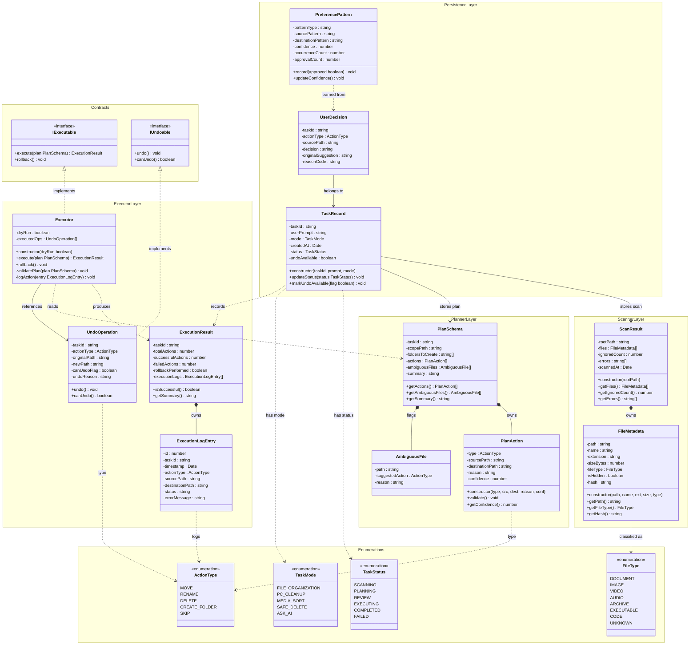

# Sentinel — Class Diagram

This document provides a class diagram illustrating the Object-Oriented design and structure of the Sentinel application.

---

## 🔗 Interactive Mermaid Source

---

## 🗂️ Overview

The class diagram outlines the core components and their relationships within Sentinel, including:

-   **Interface Layer**: Classes responsible for user interactions (`CLIHandler`, `WebAPIHandler`).
-   **Core Agent**: The central orchestration classes managing file scanning, classification, AI planning, safety validation, and execution operations (`SentinelOrchestrator` and its dependencies).
-   **Data Models**: The structural representation of data entities handling files, action plans, and execution logs.
-   **Providers**: Abstractions for interacting with external AI runtimes like `OllamaClient`.

*The interactive diagram provides a visual high-level overview of the OOP structure, avoiding the need for external image files.*
