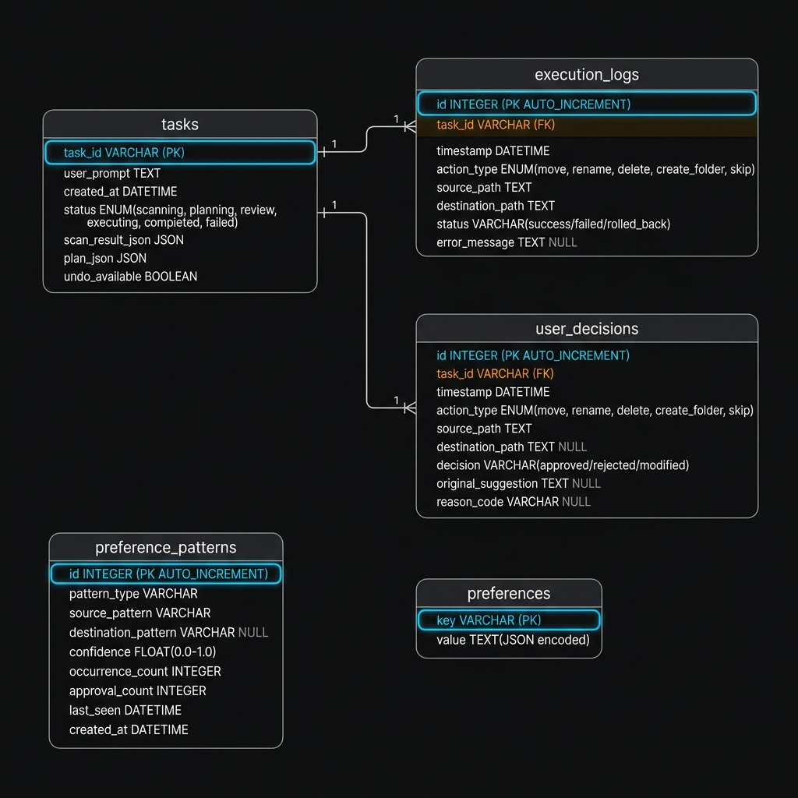
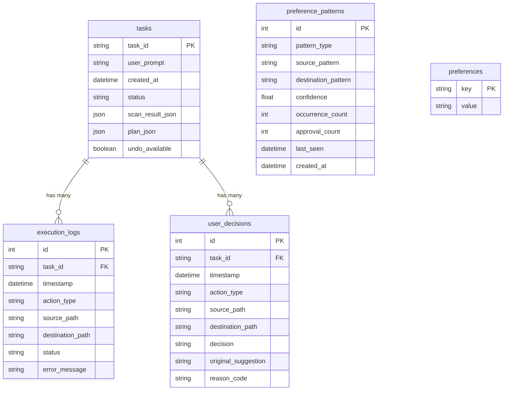

# Sentinel — Entity Relationship (ER) Diagram

This document describes the database schema for Sentinel's SQLite database located at `~/.sentinel/sentinel.db`.

The database is managed via [SQLModel](https://sqlmodel.tiangolo.com/) (a layer on top of SQLAlchemy + Pydantic).

---

## 📊 Diagram

---

## 🗂️ Tables

### `tasks`
Central record for every user-initiated cleanup task.

| Column | Type | Constraints | Description |
|--------|------|-------------|-------------|
| `task_id` | VARCHAR | **PK** | Unique task identifier |
| `user_prompt` | TEXT | NOT NULL | The user's original request |
| `created_at` | DATETIME | NOT NULL | When the task was created |
| `status` | ENUM | NOT NULL | `scanning` \| `planning` \| `review` \| `executing` \| `completed` \| `failed` |
| `scan_result_json` | JSON | NULL | Serialized scan result |
| `plan_json` | JSON | NULL | Serialized AI-generated plan |
| `undo_available` | BOOLEAN | DEFAULT TRUE | Whether undo is still possible |

---

### `execution_logs`
Audit log of every file operation executed by Sentinel.

| Column | Type | Constraints | Description |
|--------|------|-------------|-------------|
| `id` | INTEGER | **PK**, AUTO_INCREMENT | Log entry ID |
| `task_id` | VARCHAR | **FK** → `tasks.task_id` | Associated task |
| `timestamp` | DATETIME | NOT NULL | When the action was performed |
| `action_type` | ENUM | NOT NULL | `move` \| `rename` \| `delete` \| `create_folder` \| `skip` |
| `source_path` | TEXT | NOT NULL | Original file path |
| `destination_path` | TEXT | NULL | Target path (if applicable) |
| `status` | VARCHAR | NOT NULL | `success` \| `failed` \| `rolled_back` |
| `error_message` | TEXT | NULL | Error detail if failed |

---

### `user_decisions`
Tracks every user approval, rejection, or modification of a suggested action.

| Column | Type | Constraints | Description |
|--------|------|-------------|-------------|
| `id` | INTEGER | **PK**, AUTO_INCREMENT | Decision ID |
| `task_id` | VARCHAR | **FK** → `tasks.task_id` | Associated task |
| `timestamp` | DATETIME | NOT NULL | When decision was made |
| `action_type` | ENUM | NOT NULL | `move` \| `rename` \| `delete` \| `create_folder` \| `skip` |
| `source_path` | TEXT | NOT NULL | File being acted on |
| `destination_path` | TEXT | NULL | Target path (if applicable) |
| `decision` | VARCHAR | NOT NULL | `approved` \| `rejected` \| `modified` |
| `original_suggestion` | TEXT | NULL | Original AI suggestion (if user modified) |
| `reason_code` | VARCHAR | NULL | Why user rejected/modified |

---

### `preference_patterns`
AI-learned patterns derived from historical user decisions.

| Column | Type | Constraints | Description |
|--------|------|-------------|-------------|
| `id` | INTEGER | **PK**, AUTO_INCREMENT | Pattern ID |
| `pattern_type` | VARCHAR | NOT NULL (indexed) | e.g. `file_extension_destination`, `folder_structure`, `delete_approval` |
| `source_pattern` | VARCHAR | NOT NULL (indexed) | Pattern to match (e.g. `.pdf`, `IMG_*`) |
| `destination_pattern` | VARCHAR | NULL | Where files matching pattern should go |
| `confidence` | FLOAT | 0.0 – 1.0 | Approval rate from historical data |
| `occurrence_count` | INTEGER | ≥ 0 | Times this pattern was encountered |
| `approval_count` | INTEGER | ≥ 0 | Times user approved this pattern |
| `last_seen` | DATETIME | NOT NULL | Last time pattern was encountered |
| `created_at` | DATETIME | NOT NULL | When pattern was first learned |

---

### `preferences`
Key-value store for user configuration and settings.

| Column | Type | Constraints | Description |
|--------|------|-------------|-------------|
| `key` | VARCHAR | **PK** | Setting name |
| `value` | TEXT | NOT NULL | JSON-encoded setting value |

Common keys include: `preferred_destinations`, `rejected_categories`, `delete_rules_enabled`, `excluded_extensions`.

---

## 🔗 Relationships

---

## 🛢️ Database Technology

- **Engine**: SQLite (file at `~/.sentinel/sentinel.db`)
- **ORM**: SQLModel (SQLAlchemy + Pydantic)
- **Session Management**: FastAPI dependency injection via `get_db_session()`

---

*Diagram generated from actual SQLModel table definitions in `sentinel-core/sentinel_core/models/`*
