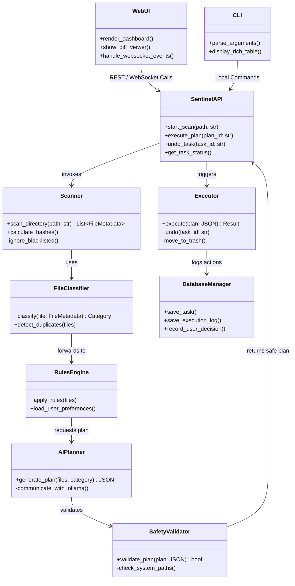

# Sentinel — UML Architecture Diagram

This diagram outlines the complete system architecture and core class interactions of the Sentinel project.

## 🔗 Architecture Overview

```mermaid
classDiagram
    class SentinelAPI {
        +start_scan(path: str)
        +execute_plan(plan_id: str)
        +undo_task(task_id: str)
        +get_task_status()
    }

    class Scanner {
        +scan_directory(path: str) List~FileMetadata~
        +calculate_hashes()
        -ignore_blacklisted()
    }

    class FileClassifier {
        +classify(file: FileMetadata) Category
        +detect_duplicates(files)
    }

    class RulesEngine {
        +apply_rules(files)
        +load_user_preferences()
    }

    class AIPlanner {
        +generate_plan(files, category) JSON
        -communicate_with_ollama()
    }

    class SafetyValidator {
        +validate_plan(plan: JSON) bool
        -check_system_paths()
    }

    class Executor {
        +execute(plan: JSON) Result
        +undo(task_id: str)
        -move_to_trash()
    }

    class DatabaseManager {
        +save_task()
        +save_execution_log()
        +record_user_decision()
    }

    class WebUI {
        +render_dashboard()
        +show_diff_viewer()
        +handle_websocket_events()
    }

    class CLI {
        +parse_arguments()
        +display_rich_table()
    }

    SentinelAPI --> Scanner : invokes
    Scanner --> FileClassifier : uses
    FileClassifier --> RulesEngine : forwards to
    RulesEngine --> AIPlanner : requests plan
    AIPlanner --> SafetyValidator : validates
    SafetyValidator --> SentinelAPI : returns safe plan
    SentinelAPI --> Executor : triggers
    Executor --> DatabaseManager : logs actions
    WebUI --> SentinelAPI : REST / WebSocket Calls
    CLI --> SentinelAPI : Local Commands
```
