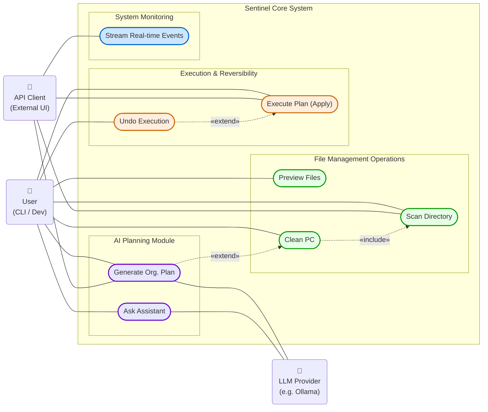

# Sentinel Core System - Use Case Diagram

```mermaid
flowchart LR
    %% Actors
    User("👤<br>User<br>(CLI / Dev)")
    APIClient("👤<br>API Client<br>(External UI)")
    LLM("👤<br>LLM Provider<br>(e.g. Ollama)")

    subgraph System ["Sentinel Core System"]
        direction TB
        
        subgraph File_Management_Operations ["File Management Operations"]
            direction TB
            ScanDir(["Scan Directory"]):::green
            PrevFiles(["Preview Files"]):::green
            CleanPC(["Clean PC"]):::green
        end

        subgraph AI_Planning_Module ["AI Planning Module"]
            direction TB
            GenPlan(["Generate Org. Plan"]):::purple
            AskAss(["Ask Assistant"]):::purple
        end

        subgraph Execution_Reversibility ["Execution & Reversibility"]
            direction TB
            ExecPlan(["Execute Plan (Apply)"]):::orange
            UndoExec(["Undo Execution"]):::orange
        end
        
        subgraph System_Monitoring ["System Monitoring"]
            direction TB
            StreamEvents(["Stream Real-time Events"]):::blue
        end
    end

    %% Associations
    User --- ScanDir
    User --- PrevFiles
    User --- CleanPC
    User --- GenPlan
    User --- AskAss
    User --- ExecPlan
    User --- UndoExec

    APIClient --- ScanDir
    APIClient --- GenPlan
    APIClient --- ExecPlan
    APIClient --- StreamEvents

    GenPlan --- LLM
    AskAss --- LLM

    %% Dependencies
    CleanPC -. "«include»" .-> ScanDir
    GenPlan -. "«extend»" .-> CleanPC
    UndoExec -. "«extend»" .-> ExecPlan

    classDef green fill:#e6ffe6,stroke:#009900,stroke-width:2px;
    classDef purple fill:#e6e6ff,stroke:#6600cc,stroke-width:2px;
    classDef orange fill:#ffeedd,stroke:#cc6600,stroke-width:2px;
    classDef blue fill:#cce6ff,stroke:#0066cc,stroke-width:2px;
```
