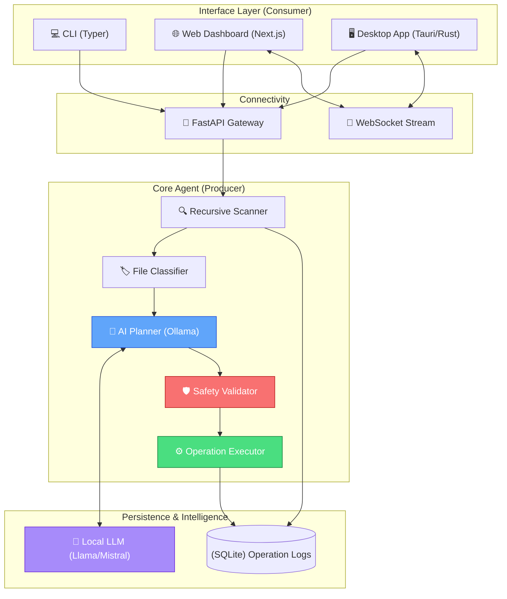

# 🏗️ System Architecture

Sentinel is built as a modular, local-first AI system. It separates expensive filesystem operations and AI planning from the user interface, ensuring safety and performance.

## 🗺️ High-Level Component Map

## 🔄 Data Integrity Flow

1.  **Scan Phase**: The `Scanner` traverses the target directories, generating metadata for each file.
2.  **Classification Phase**: Files are categorized (Installers, Screenshots, Duplicates) based on content hashes and heuristic rules.
3.  **Planning Phase**: The `AI Planner` summarizes findings and sends them to the local LLM. The LLM suggests a "Cleanup Plan" in JSON format.
4.  **Validation Phase**: The `Safety Validator` intercepts the plan. It checks against protected system paths and ensures all operations are permitted.
5.  **Review Phase**: The user reviews the plan via their chosen interface.
6.  **Execution Phase**: The `Executor` performs the confirmed actions, logging each one for potential undo operations.

## 🛡️ Safety Invariants

*   **Non-Destructive by Default**: All "deletions" are actually move operations to the system Trash/Recycle Bin.
*   **Air-Gapped Operation**: No data is sent to external servers. LLM processing happens entirely on the local machine via Ollama.
*   **Atomic Transactions**: Operations are logged before execution, allowing for 100% reversible outcomes.
*   **Privilege Boundary**: Sentinel never requests root/sudo permissions for standard cleanup tasks.

## ⚙️ Technical Stack

| Component | Technology | Rationale |
| :--- | :--- | :--- |
| **Backend** | Python 3.11+ | Rapid development of AI integrations and OS-level glue. |
| **API** | FastAPI | High performance, automatic OpenAPI documentation. |
| **Frontend** | Next.js 14 | Industry-standard developer experience and performance. |
| **Desktop** | Tauri | Lightweight alternative to Electron; Rust-based security. |
| **AI Runtime** | Ollama | Simplest way to run high-performance local LLMs. |
| **Database** | SQLite + SQLAlchemy | Zero-configuration, local-first persistence. |
