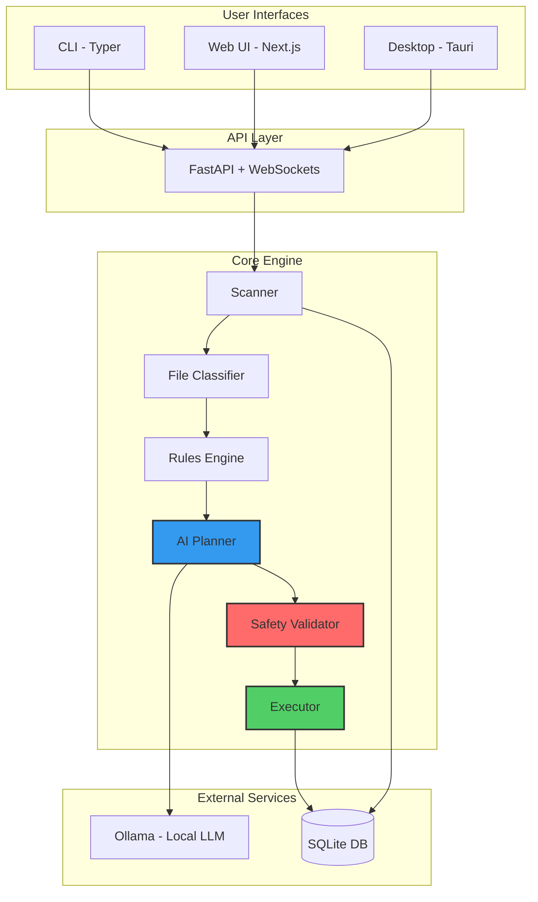
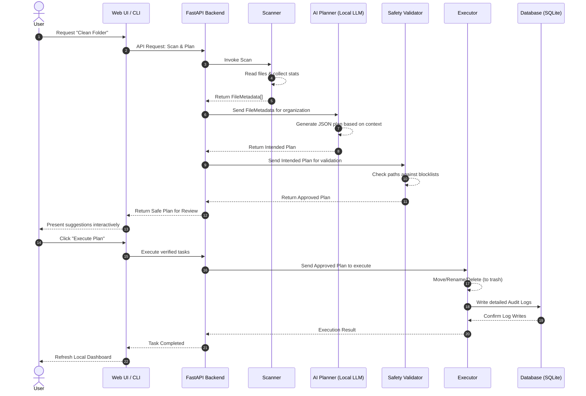

# Sentinel: Project Report
**AI-Powered File Organization & Cleanup Agent**

---

## 1. Abstract
Sentinel is an intelligent, local-first AI agent designed to automate the organization and cleanup of file systems. Traditional file management tools rely on rigid rules and manual intervention. Sentinel bridges this gap by leveraging local Large Language Models (LLMs) via Ollama, combined with deterministic execution rules. This ensures that the system can intuitively categorize files, detect duplicates, and suggest optimal organization plans, all while strictly prioritizing user data safety and system integrity.

## 2. Introduction
As digital storage capacities grow, users accumulate thousands of files, leading to cluttered directories, duplicated content, and wasted disk space. Manually organizing these files is a tedious and time-consuming task. Sentinel acts as a smart assistant that scans your file system, understands the context and content of your files, and proposes a comprehensive cleanup and organization plan. Built with a focus on local execution, Sentinel ensures that your personal data never leaves your machine.

## 3. Problem Statement
- **Cluttered Workspaces:** Users struggle with unorganized folders (like Downloads or Desktop) filled with mixed file types (installers, screenshots, old archives).
- **Redundant Data:** Duplicate files consume valuable storage space without the user's knowledge.
- **Privacy Concerns:** Cloud-based cleanup tools require uploading file metadata or content to external servers, posing significant privacy risks.
- **Risk of Data Loss:** Automated scripts can accidentally delete important system files or personal documents.

## 4. Objectives
- **Intelligent Classification:** Automatically detect and categorize files (e.g., old installers, archives, media, duplicates).
- **AI-Driven Planning:** Generate smart, context-aware file organization plans without executing them blindly.
- **Strict Safety:** Ensure no destructive actions (like permanent deletion) occur without explicit user approval.
- **Local First:** Maintain 100% data privacy by running the AI models locally.
- **Accessibility:** Provide multiple interfaces (CLI, Web Dashboard, Desktop App) to cater to different user preferences.

## 5. System Architecture
Sentinel operates on a modular architecture divided into several key layers. The following diagram illustrates the high-level architecture and how different components interact:

## 6. Core Modules & Workflow

Sentinel follows a strict execution flow from user request to final file movement. The sequence diagram below shows this workflow:

1. **Scanning:** The user initiates a scan on a specific directory. The Scanner traverses the directory and computes hashes for duplicate detection.
2. **Classification:** The File Classifier categorizes each file based on its metadata and extension.
3. **Planning:** The AI Planner processes the classified data and generates a structured JSON plan suggesting moves, archives, and deletions.
4. **Validation:** The Safety Validator intercepts the plan, checking it against system blacklists and safety protocols.
5. **Execution & Auditing:** Upon user approval, the Executor performs the actions. Every operation is recorded in the SQLite Database, enabling full reversibility (Undo).

## 7. Safety & Security Guarantees
Safety is the foundational principle of Sentinel. The system enforces the following invariants:
- **AI Does Not Execute:** The LLM only generates a suggested plan; it has no direct access to the file system.
- **Trash-First Deletion:** Files are moved to the Trash/Recycle Bin rather than being permanently deleted.
- **System Blacklisting:** Critical directories (`/System`, `/Windows`, `/usr`) are strictly off-limits.
- **Full Reversibility:** An undo log is maintained for every operation, allowing users to restore their file system to its previous state instantly.

## 8. Technology Stack
- **Backend/Core Engine:** Python 3.11+, FastAPI, SQLAlchemy, Pydantic, Typer
- **AI Integration:** Ollama (Local LLM)
- **Frontend/Web UI:** Next.js 14, TypeScript, Tailwind CSS, Zustand, Framer Motion
- **Desktop Application:** Rust, Tauri
- **Database:** SQLite

## 9. Future Scope
- **Advanced Automation:** Implement scheduled watch-folders that automatically organize new files as they are downloaded.
- **Smart Folder Suggestions:** AI-generated naming conventions and tag-based organization systems.
- **Plugin Ecosystem:** Allow developers to write custom plugins for specialized file types (e.g., code repositories, RAW photo management).
- **Cross-Device Sync:** Share organization rules and preferences securely across multiple devices.

## 10. Conclusion
Sentinel redefines file management by merging local artificial intelligence with rigorous safety protocols. By automating the categorization and cleanup processes while keeping the user in full control, Sentinel saves time, reclaims storage space, and provides peace of mind without compromising data privacy.
